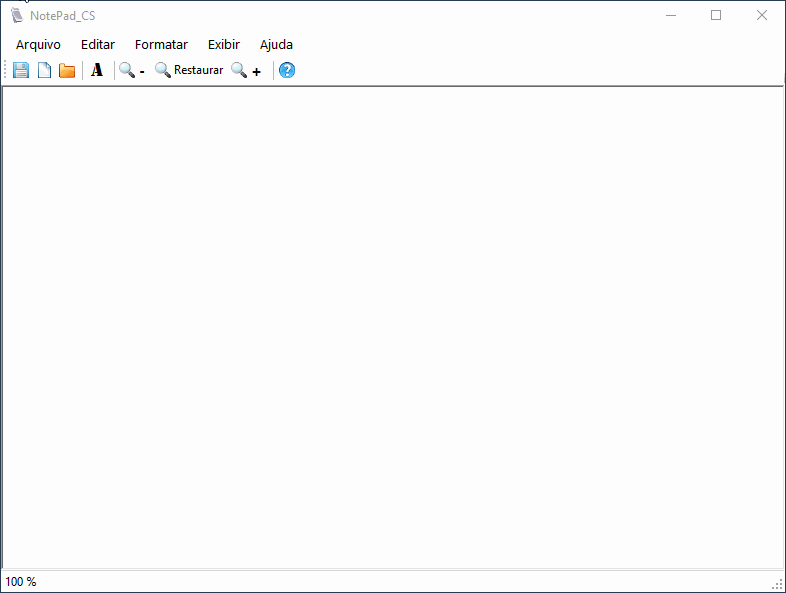

   

<h1>Bloco de notas em C#</h1>

> Aplicativo completo de bloco de notas para estudo de C# com .net

Código fonte e aplicação gratuito para quaisquer finalidades. Peço que se possível:

- [ ] cite a fonte
- [ ] me conte o que achou

-------------

## Demo

   

## Como instalar?

- Baixe o instalador [aqui](deploy/NotePadCS.zip)
- Execute o arquivo installer .exe
- _voilá_ é só alegria.

---------

<!-- CONTACT -->

## 4. Contato

**Author:** Jonas Araujo de Avila Campos

  
  

